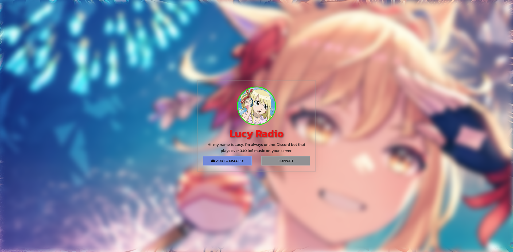

# Lucy Radio

Hi, my name is _Lucy_. I’m always online, Discord bot that plays over 340 lofi music on your server. Music bot that plays lofi music 24/7 in your server.
 
Invite [here](https://top.gg/bot/1089486211376222228/invite), or join the support server [here](https://discord.gg/WFfjrQxnfH).

## Commands

| Command       | Description                                             |
| ------------- | ------------------------------------------------------- |
| `/add`        | Add a station to the queue.                             |
| `/autoadd`    | Toggle auto music adding at the end of a music.         |
| `/find`       | Find some stations that you like using tags.            |
| `/guide`      | Displays Lucy Radio bot's guide.                        |
| `/help`       | Displays help page.                                     |
| `/info`       | Displays informations.                                  |
| `/leave`      | Leave the voice channel.                                |
| `/play`       | Play a Lucy Radio with Lofi Music.                      |
| `/playing`    | Show the current music.                                 |
| `/suggestion` | Suggest a lofi music to the bot.                        |
| `/volume`     | Set the volume of the music.                            |

More help
If you need more help, use the command guide

  <h2><b>LUCY RADIO</b></h2>
  Live: <a href="https://lucyradio.is-a.fun"> https://lucyradio.is-a.fun</a>
   
  

